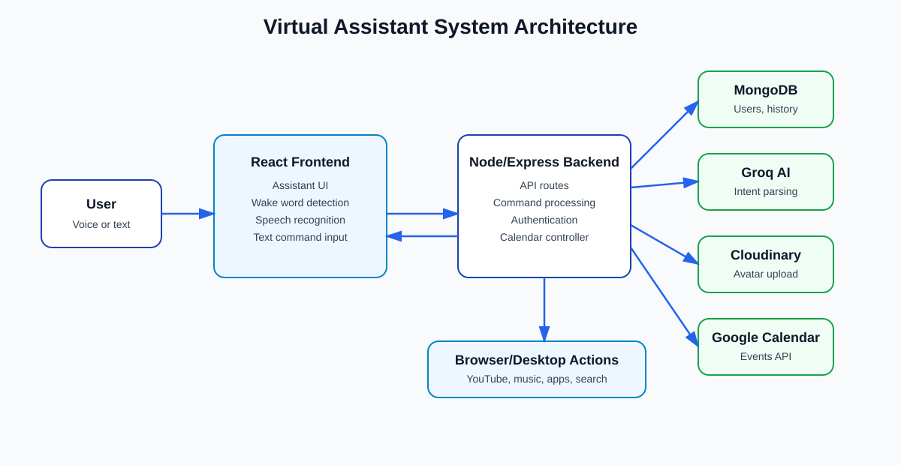
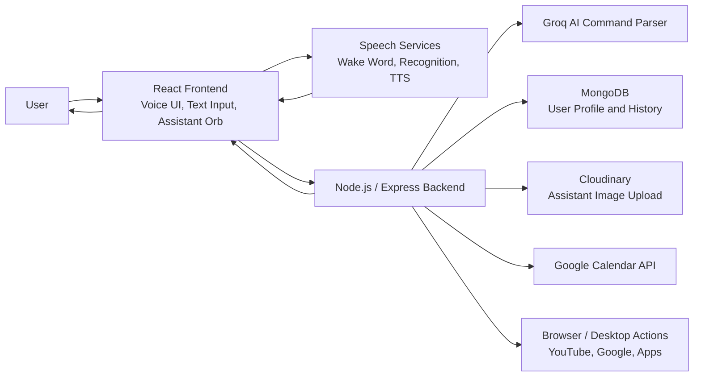
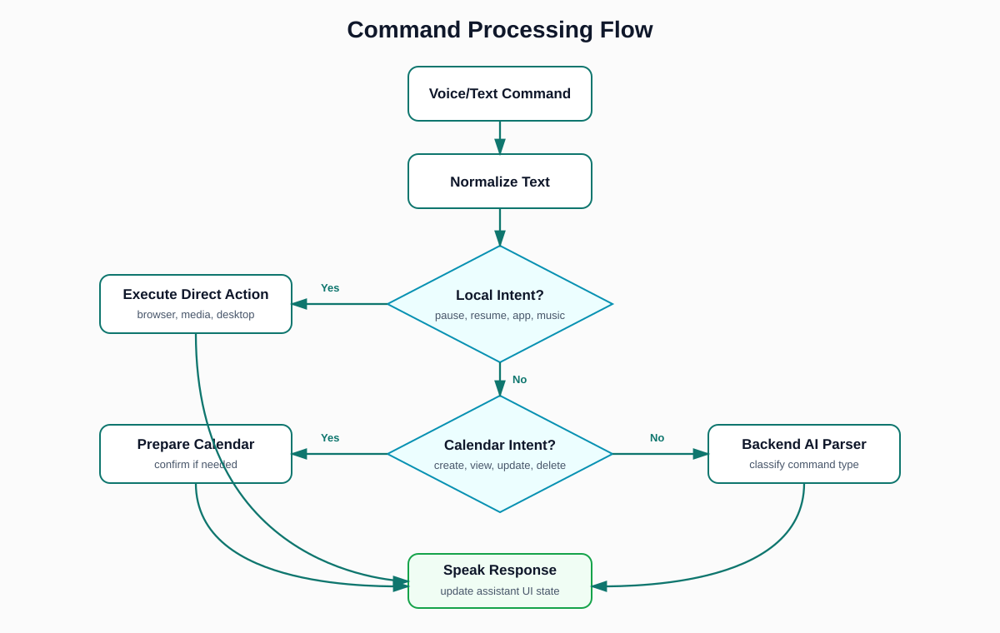
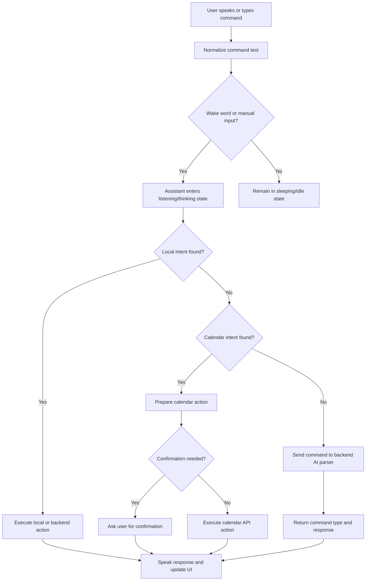
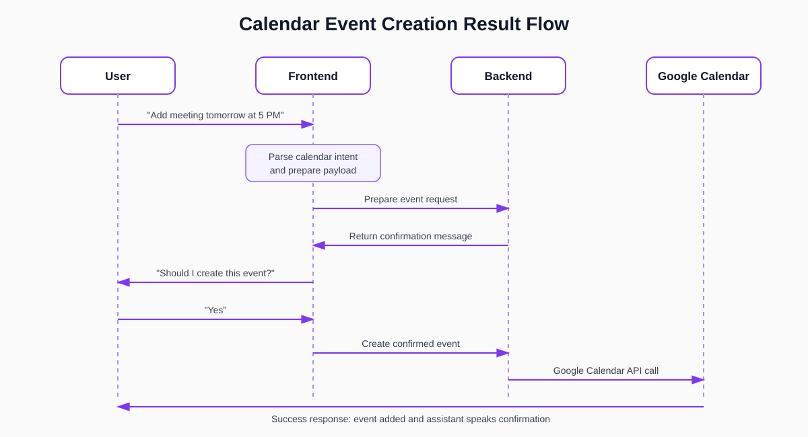
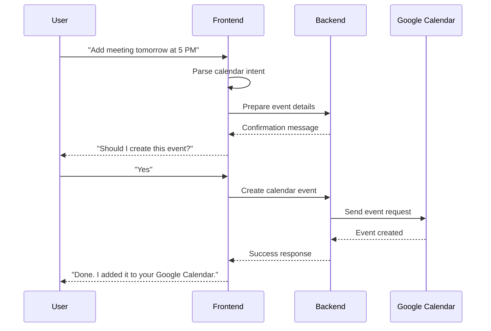

# Chapter: Result and Analysis

## 1. Introduction

This chapter presents the results obtained after developing and testing the Virtual Assistant project. The system was implemented as a MERN-based voice assistant with a React frontend, Node.js and Express backend, MongoDB user storage, JWT authentication, AI-based command classification, speech input/output, media control, desktop application commands, and Google Calendar integration.

The main objective of the project was to build a personalized assistant that can understand typed or spoken user commands and perform useful actions such as answering questions, opening websites, playing music, controlling media, launching Windows applications, and managing calendar events. The developed system successfully demonstrates these features through an interactive assistant interface.

## 2. Overall System Result

After implementation, the virtual assistant provides a complete user workflow from account creation to command execution. A user can sign up, sign in, customize the assistant name and avatar, wake the assistant by voice, give commands, receive spoken responses, and use text input when voice input is not preferred.

The final system includes the following major results:

| Module | Result |
| --- | --- |
| User Authentication | Users can sign up, sign in, remain logged in through JWT cookies, and log out securely. |
| Assistant Customization | Users can select or upload an assistant image and set a custom assistant name. |
| Wake Word Detection | The assistant detects wake phrases such as "Hey AssistantName" and enters listening mode. |
| Speech Recognition | The assistant accepts voice commands through browser speech recognition, with optional offline speech support. |
| Text Commands | Users can type commands through the same command processor used for voice commands. |
| AI Command Understanding | General and ambiguous commands are classified using the AI backend. |
| Local Intent Handling | Common commands such as pause, resume, open Chrome, play music, and search Google are handled quickly. |
| Speech Output | The assistant replies using browser speech synthesis. |
| Music and YouTube Control | The assistant can search YouTube, play YouTube Music, pause, resume, stop, and skip media. |
| Calendar Integration | The assistant can connect with Google Calendar and create, view, update, delete, and search events. |

## 3. System Architecture Diagram

The following diagram shows the high-level architecture of the developed virtual assistant.





## 4. Command Processing Result

The assistant processes commands using a layered approach. First, the frontend checks whether the command is a direct local intent, such as sleep, stop, pause, resume, open YouTube, or play music. If the command is related to calendar management, the frontend prepares a calendar intent and asks for confirmation where required. If the command is general or unclear, it is sent to the backend, where the AI model classifies it into an internal command type.





This flow improves reliability because frequent commands do not depend entirely on the AI model. For example, commands such as "pause", "resume", "next song", "open Chrome", and "go to sleep" can be recognized directly using rule-based intent matching.

## 5. User Interface Result

The final frontend provides a dark assistant-style interface with the following visible elements:

| UI Element | Purpose |
| --- | --- |
| Assistant Orb | Displays the assistant avatar and visual state. |
| Status Text | Shows whether the assistant is sleeping, listening, thinking, speaking, or idle. |
| Voice Visualizer | Displays recognized/interim speech text. |
| Wake Phrases Panel | Shows sample wake phrases based on the custom assistant name. |
| Calendar Panel | Shows Google Calendar connection status and upcoming events. |
| Text Input Bar | Allows typed commands as an alternative to voice commands. |
| Control Buttons | Provide microphone, sleep, customization, and logout actions. |

Suggested result screenshots to insert in the report:

1. Login or signup page.
2. Assistant customization page showing avatar/name selection.
3. Main assistant home page in sleeping state.
4. Main assistant home page while listening or thinking.
5. Calendar panel after connecting Google Calendar.
6. Example command result such as "Opening YouTube" or "Playing a song".

If screenshots are captured from the running project, they can be inserted with captions such as:

```markdown

Figure: Main interface of the virtual assistant after successful login and customization.


Figure: Google Calendar panel displaying events and connection status.
```

## 6. Functional Result Analysis

### 6.1 Authentication and User Profile

The authentication module works as the entry point of the system. Users can create an account and log in using email and password. Passwords are protected using bcrypt hashing, and JWT cookies are used to maintain the authenticated session. After login, the current user profile is loaded automatically, and protected routes prevent unauthorized access to the assistant screen.

This result shows that the project supports personalized access rather than acting as a single-user static assistant. The assistant name, image, and command history are stored per user, making the system more useful for real users.

### 6.2 Assistant Customization

The assistant customization module allows users to choose from built-in assistant images or upload a custom image. Uploaded images are stored through Cloudinary, while the selected assistant name and image are saved in MongoDB. The assistant name is also used to generate wake phrases.

This feature improves user experience because the assistant feels personalized. It also connects directly with the wake-word logic, because the system uses the selected assistant name when listening for commands.

### 6.3 Voice Input and Wake Word Result

The assistant supports continuous wake monitoring after microphone permission is granted. It can detect phrases such as:

| Wake Phrase Type | Example |
| --- | --- |
| Direct name | "Robin" |
| Greeting phrase | "Hey Robin" |
| Polite wake phrase | "Okay Robin" |
| Action wake phrase | "Wake up Robin" |
| Wake plus command | "Hey Robin play music" |

The wake-word system improves usability because the user does not need to press a button for every command. The manual microphone button is also available as a fallback.

### 6.4 AI Response and Command Classification

The backend uses an AI command parser to classify user commands into structured command types. Examples of internal command types include:

| Command Type | Example User Command | Expected Result |
| --- | --- | --- |
| `general` | "What is artificial intelligence?" | Assistant gives a short explanation. |
| `google-search` | "Search Google for React hooks" | Google search opens in browser. |
| `youtube-search` | "Play React tutorial on YouTube" | YouTube video search/playback starts. |
| `play-music` | "Play Perfect" | YouTube Music playback starts. |
| `get-time` | "What time is it?" | Assistant speaks current time. |
| `open-vscode` | "Open VS Code" | Visual Studio Code launches. |
| `pause-media` | "Pause" | Current music playback pauses. |
| `next-media` | "Next song" | Music moves to next track. |

The system also includes fallback logic. If the AI response is unclear, the backend attempts to infer obvious command types from the original user command. This makes the assistant more stable and prevents simple commands from failing unnecessarily.

### 6.5 Calendar Integration Result

The Google Calendar module is one of the most advanced parts of the project. It allows the assistant to perform practical scheduling tasks through natural commands.





Calendar actions such as creating, updating, and deleting events use a confirmation step. This is important because calendar changes affect real user data. The assistant first explains what it understood, then waits for the user to confirm before making changes.

## 7. Testing and Validation Results

The project was validated using build and syntax checks.

| Test | Result | Observation |
| --- | --- | --- |
| Frontend production build | Passed | Vite successfully built the React application. |
| Backend `index.js` syntax check | Passed | No syntax errors found. |
| Assistant controller syntax check | Passed | No syntax errors found. |
| Calendar controller syntax check | Passed | No syntax errors found. |
| Google Calendar service syntax check | Passed | No syntax errors found. |
| Date parser syntax check | Passed | No syntax errors found. |

Frontend build output confirmed that the application can be compiled for production. However, the build produced a warning about large JavaScript chunks. The largest chunk is related to the optional Vosk speech-recognition bundle. This does not stop the application from building, but it indicates that future optimization can be done using code splitting or lazy loading.

## 8. Sample Result Table

The following table summarizes sample command results observed from the implemented logic.

| Input Command | Processing Module | Output / Action |
| --- | --- | --- |
| "Hey Robin" | Wake-word detection | Assistant wakes and asks for the next command. |
| "Open YouTube" | Local intent and browser action | YouTube opens in a new browser tab. |
| "Search Google for JavaScript promises" | Local/backend command processing | Google search page opens with the query. |
| "Play Faded" | Music intent | YouTube Music searches and plays the requested song. |
| "Pause" | Media control intent | Current media pauses. |
| "Next song" | Media control intent | Next music track plays. |
| "What time is it?" | Backend date/time handler | Assistant returns the current time. |
| "Open Notepad" | Desktop command executor | Notepad opens on Windows. |
| "Add meeting tomorrow at 5 PM" | Calendar intent service | Assistant prepares event and asks for confirmation. |
| "What is artificial intelligence?" | AI general response | Assistant provides a short spoken explanation. |

## 9. Result Images and Diagram Placement

For the final report, the following images are recommended:

| Figure No. | Image / Diagram | Description |
| --- | --- | --- |
| Figure 1 | System architecture diagram | Shows relation between user, frontend, backend, AI, database, Cloudinary, and Google Calendar. |
| Figure 2 | Command processing flowchart | Shows how voice/text commands are classified and executed. |
| Figure 3 | Calendar sequence diagram | Shows event creation with confirmation. |
| Figure 4 | Signup/signin screenshot | Shows user authentication result. |
| Figure 5 | Customization screenshot | Shows assistant name and avatar selection. |
| Figure 6 | Home page screenshot | Shows final assistant interface. |
| Figure 7 | Calendar panel screenshot | Shows calendar event display and connection status. |
| Figure 8 | Build result screenshot | Shows successful frontend build in terminal. |

If the report is prepared in Word, the Mermaid diagrams can be rendered as images using an online Mermaid renderer or a Markdown editor that supports Mermaid export. The screenshots can be captured manually by running the frontend and backend locally.

## 10. Limitations Observed

Although the developed assistant works successfully for the main project goals, some limitations were observed:

1. Browser speech recognition depends on browser support and microphone permission.
2. Desktop application commands are mainly designed for Windows.
3. YouTube and YouTube Music automation may be affected if the website layout changes.
4. Weather currently opens a Google weather search instead of using a dedicated weather API.
5. Email command type exists in the command schema, but full email sending is not completely implemented.
6. The frontend build contains large chunks because optional speech-recognition libraries increase bundle size.
7. Calendar operations require Google OAuth configuration before they can work in a real user account.

## 11. Conclusion

The result of the project shows that the Virtual Assistant successfully combines voice interaction, AI-based command understanding, user personalization, browser actions, desktop commands, media control, and Google Calendar management into one working system. The assistant is able to accept both spoken and typed commands, classify user intent, perform actions, and respond through speech and the user interface.

The analysis also shows that the system has been designed with practical fallback mechanisms. Common commands are handled locally for faster response, while the backend AI parser is used for broader natural-language understanding. The successful frontend build and backend syntax checks confirm that the main implemented modules are structurally valid. Overall, the project meets its objective of creating an interactive and personalized virtual assistant, while still leaving scope for future improvements such as performance optimization, dedicated weather APIs, complete email support, and more advanced offline voice recognition.
